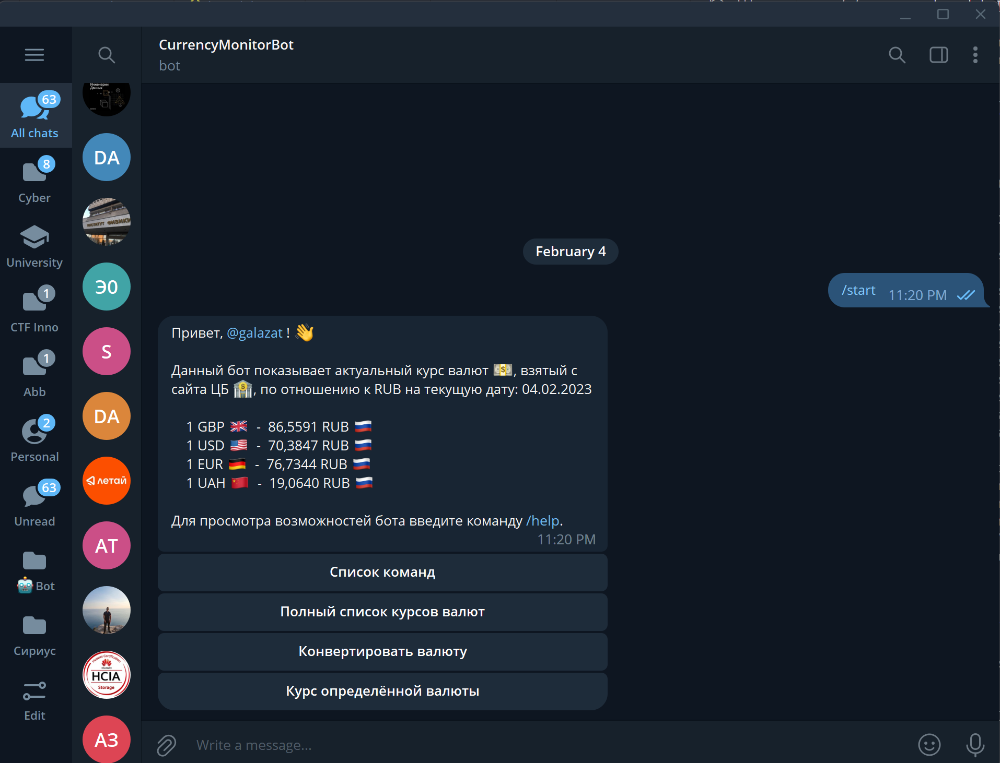
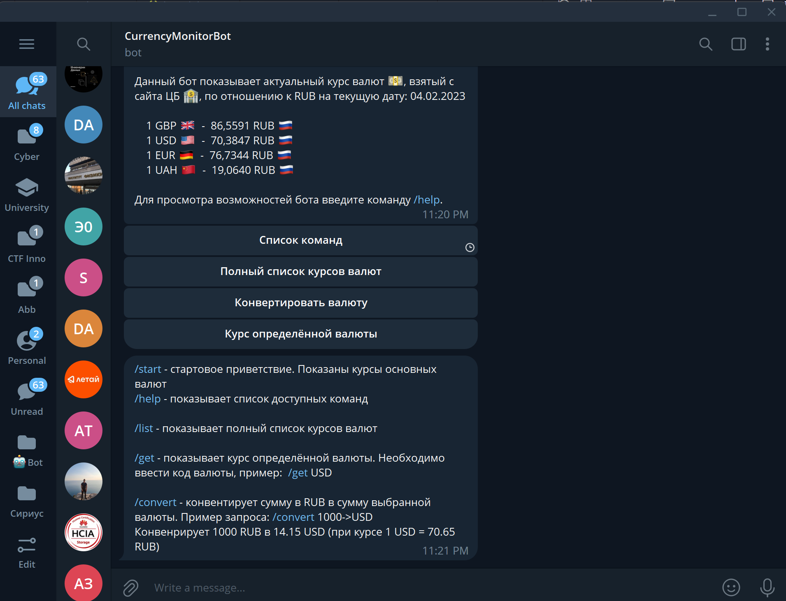
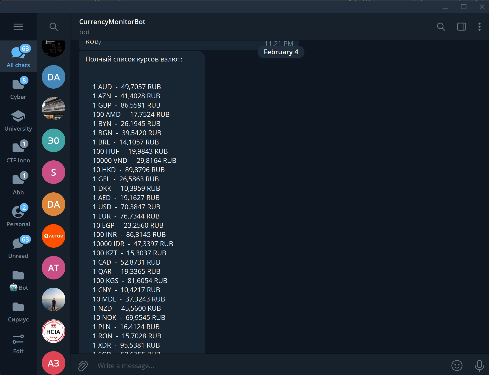

# CurrencyMonitorBot 

Телеграм бот показывает актуальный курс валют, взятые с сайта ЦБ России, по отношению к RUB на текущую дату. 
Данные по актуальным коритовкам валют беруться с сайта cbr.ru, пример: http://www.cbr.ru/scripts/XML_daily.asp?date_req=02/03/2002

Курс валют в телеграм боте обновляется ежедневно в 00:01:00. 

Ссылка на бота : https://t.me/galCustomBot

# Использование

Введите команду ```/start```


Список команд ```/help```


Полный список валют ```/list```

